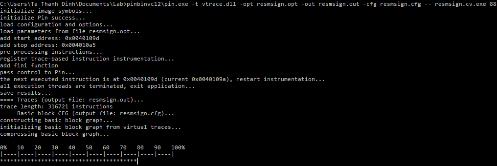

# relative-pattern
This is a tool experimenting a *formal method* for recovering program control flow graph from binaries virtualized by
* [Tigress](http://tigress.cs.arizona.edu/)
* [VMProtect](http://vmpsoft.com/)
* [Code Virtualizer](http://oreans.com/)
* [O-LLVM](https://github.com/obfuscator-llvm/obfuscator)1
* Other ad-hoc implementations2.

The code is in active development, still buggy and difficult to use. The modules of the concolic execution engine are not published yet, though the current published code can work with any concolic or fuzzing engine. Currently there is no documentation (please contact me if you are interested in). I try also to prepare a paper on this but there are still a lot of things to do.

Though the tool follows a mathematical approach, seriously I think the main idea is not new. It may be considered implicitly in many practical "unpack tutorials" of great hackers and crackers. While I am just a newbie, the only original contribution here is to give a more solid *theoretical base* that explains these concrete techniques, and this leads to a "less ad-hoc"3 deobfuscation technique.

The tool is written mostly in C++ and OCaml, and uses the following softwares:
* [BinSec](http://binsec.gforge.inria.fr/)
* [Pin](https://software.intel.com/en-us/articles/pin-a-dynamic-binary-instrumentation-tool)
* [Boost](http://www.boost.org/)
* [tinyformat](https://github.com/c42f/tinyformat)
* [Protocol Buffers](https://github.com/google/protobuf)
* [ELFIO - ELF](https://github.com/serge1/ELFIO)

1[O-LLVM](https://github.com/obfuscator-llvm/obfuscator) does not support yet virtualization transformations, though control-flow-graph flattening can be considered as a "light-weight" virtualization.

2Collected from [crackmes.de](http://crackmes.de/).

3Hopefully.
